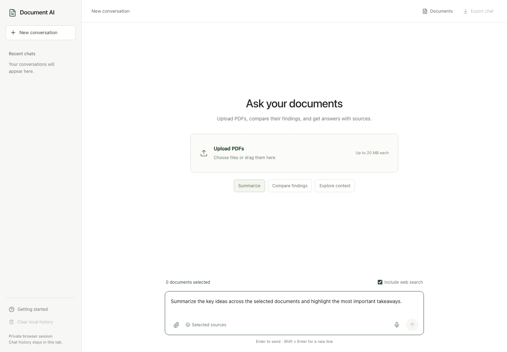

# Document AI

A document research workspace built with Next.js, React, TypeScript, Tailwind CSS, CopilotKit, and AG-UI. Select PDFs from your library, ask a question across them, and receive a streamed answer with document and web sources.



## How it works

1. Next.js Route Handlers establish the user identity, accept uploads, and protect the agent connection.
2. LangChain loads and splits each PDF once. OpenAI embeddings are stored in the explicitly selected vector backend: a persistent SQLite index for localhost, or Pinecone for cloud retrieval. Both scope vectors to the document owner. A SQLite catalog records document ownership and ingestion status.
3. A custom Google ADK agent plans whether external information is needed, retrieves passages from the selected owned documents, optionally calls the MCP web-search tool, and streams one answer using `gpt-5.6-sol` through LiteLLM.
4. AG-UI carries text, tool events, and explicit progress/source state through the Next.js CopilotRuntime. CopilotKit headless hooks update the existing custom UI.

The agent uses persistent ADK sessions in SQLite. It accepts the latest user question from the browser and loads its own conversation history. Client-supplied system messages, tool results, user IDs, and retrieved evidence are not trusted.

## Setup

Use Node.js 24 LTS and Python 3.12. The examples use [uv](https://docs.astral.sh/uv/). On Apple Silicon, use native ARM Python to install current binary dependencies.

```sh
nvm use
npm ci
npm run setup:env
uv venv --python 3.12
uv pip install -r agent_service/requirements-dev.txt
```

Edit `.env.local`:

| Variable                      | Purpose                                                                                     |
| ----------------------------- | ------------------------------------------------------------------------------------------- |
| `OPENAI_API_KEY`              | A valid OpenAI API key with access to the generation and embedding models.                  |
| `OPENAI_MODEL`                | Defaults to `gpt-5.6-sol`; no silent model substitution.                                    |
| `OPENAI_TRANSCRIPTION_MODEL`  | Voice input model, defaults to `gpt-transcribe`.                                            |
| `OPENAI_EMBEDDING_MODEL`      | Defaults to `text-embedding-3-small`.                                                       |
| `OPENAI_EMBEDDING_DIMENSIONS` | Defaults to `1536`, matching the Pinecone index.                                            |
| `VECTOR_BACKEND`              | `local` for persistent SQLite cosine search; `pinecone` for the existing cloud integration. |
| `PINECONE_API_KEY`            | Required only in Pinecone mode; access to your existing index.                              |
| `PINECONE_INDEX_HOST`         | Existing dense, cosine index host. Alternatively set `PINECONE_INDEX_NAME`.                 |
| `SERPAPI_KEY`                 | Enables the optional MCP web search.                                                        |
| `AUTH_SECRET`                 | Random session-signing secret generated by `setup:env`.                                     |
| `AGENT_SERVICE_TOKEN`         | Separate random secret shared by Next.js and the private Python service.                    |
| `AGENT_SERVICE_URL`           | Defaults to `http://127.0.0.1:8000`.                                                        |
| `APP_ORIGIN`                  | Exact browser origin, including port. The example uses `http://127.0.0.1:3001`.             |
| `DOCUMENTAI_DATA_DIR`         | Persistent directory for PDF files, ownership catalog, and ADK sessions.                    |

The setup script preserves existing configuration and never prints secrets. For local migration only, the agent can reuse `OPENAI_API_KEY` and `SERPAPI_KEY` from the original `server/.env` when those entries are empty in `.env.local`. A clean clone needs its own keys. The example explicitly sets `VECTOR_BACKEND=local`, so localhost needs an OpenAI key but no Pinecone account. Local mode uses real embeddings and cosine similarity with vectors persisted in SQLite. There is no mock or in-memory retrieval fallback. An unset `VECTOR_BACKEND` retains the existing Pinecone behavior and fails clearly if its configuration is missing; provider errors never silently switch storage backends. The application never provisions a Pinecone index automatically.

Run in two terminals:

```sh
npm run agent
```

```sh
npm run dev -- --hostname 127.0.0.1 --port 3001
```

Open [Document AI](http://127.0.0.1:3001). Production uses `npm run build` and `npm start -- --port 3001` plus the agent service. Set an HTTPS `APP_ORIGIN` for an HTTPS deployment. Keep the Python service private and preserve the data directory between restarts.

Local mode keeps PDFs, vectors, ownership metadata, and ADK sessions under `<DOCUMENTAI_DATA_DIR>/local/`. Pinecone mode preserves the existing data directory. Switching modes opens a separate library and conversation store; it does not migrate documents. For cloud retrieval, set `VECTOR_BACKEND=pinecone`, supply its API key and index host/name, and restart both the Next.js and agent services.

The local index is intended for small development libraries: it performs exact cosine search over selected documents and bounds vector counts and query work. Use Pinecone for larger workloads. Both modes still send document text to OpenAI for embeddings and answer generation.

## Identity and document isolation

`AUTH_MODE=session` explicitly enables an anonymous browser workspace for local use. A signed, HttpOnly cookie identifies the owner. This isolates different browser sessions; it does not identify a person or provide cross-device login. Losing this cookie loses access to that anonymous library.

For account-based ownership, set:

```dotenv
AUTH_MODE=github
AUTH_GITHUB_ID=your_oauth_client_id
AUTH_GITHUB_SECRET=your_oauth_client_secret
```

Register `<APP_ORIGIN>/api/auth/callback/github` as the GitHub OAuth callback. Auth.js verifies the account and the server uses the stable GitHub account ID for ownership. An unset `AUTH_MODE` requires GitHub authentication. The UI keys local history by owner and refreshes identity when the window regains focus.

Every document read, retrieval, and deletion checks the server-owned SQLite catalog. Both local and Pinecone queries use an owner-derived namespace plus the selected document IDs. Neither the model nor the browser chooses an owner or namespace. The Python service requires the internal service token. CopilotKit run, reconnect, status, and stop operations also namespace their shared memory keys by owner, and its unscoped inspector/history endpoints are disabled.

## Workspace behavior

- Focused two-column layout, with the document library in an on-demand dialog.
- Upload PDF files up to 20 MiB and select up to 20 documents per question. Server limits also bound pages, extracted text, and chunks.
- Persistent document library; PDFs do not need re-uploading after a refresh or before every question.
- Streaming Markdown answers, source labels, explicit retrieval/search progress, copy, read aloud, editable voice dictation, retry, and Markdown export.
- Voice input records up to two minutes with the browser microphone. Click stop to send the recording to OpenAI through authenticated `/api/transcriptions` and the private agent service. Review or edit the transcript before sending your question. Recordings are limited to 8 MiB, processed in memory, and not stored by Document AI. Editing the draft, changing conversations, or cancelling stops capture and discards late results.
- Optional web search uses an actual stdio MCP server backed by SerpAPI. The planner receives the user question and document count, not retrieved document contents. Search queries still leave the application when web search is enabled.
- Stop aborts the active browser stream and its corresponding upstream agent execution. A provider request or blocking vector operation already submitted may finish, but the canceled run must not continue to synthesis or append a late answer.
- Clearing local chat history does not delete uploaded PDFs. Document deletion is a separate library action.

Document retrieval currently uses dense vector similarity. Web search supplements document evidence; this is not a sparse-plus-dense ranking implementation. Scanned PDFs require OCR before upload. Tool sources provide page references, but an LLM-generated citation still needs human verification.

The default deployment runs one Next.js process and one Python agent process with persistent local storage. CopilotKit's bounded run/reconnect cache is in process memory, while documents and ADK sessions are durable. Multiple application replicas require shared storage and a distributed runner/session deployment; the included local topology does not provide that coordination.

The original Express backend under `server/` is no longer called by this UI. The active backend is `agent_service/`; the original local backend and its uploads remain outside this PR.

## Verification

```sh
npm run lint
npm run typecheck
npm test
npm run test:agent
npm run build
npm run test:integration
npx playwright install chromium
npm run test:e2e
```

Tests cover PDF ingestion, persistent ownership, cross-user access rejection, selected multi-document retrieval, bounded retries, actual ADK/AG-UI event conversion, cancellation, signed sessions, runtime isolation, and browser interactions. Automated tests use synthetic documents and fake external providers; they do not call paid APIs. Live OpenAI/SerpAPI verification additionally requires working credentials. Local vector retrieval needs no additional service; testing Pinecone additionally requires its credentials and an existing compatible index.

## References

- [CopilotKit headless UI](https://docs.copilotkit.ai/google-adk/headless) and [runtime](https://docs.copilotkit.ai/backend/copilot-runtime)
- [Google ADK custom agents](https://adk.dev/agents/custom-agents/) and [LiteLLM integration](https://adk.dev/agents/models/litellm/)
- [Pinecone namespaces](https://sdk.pinecone.io/python/how-to/vectors/namespaces.html)
- [GPT-5.6 Sol](https://developers.openai.com/api/docs/models/gpt-5.6-sol)
- [Auth.js GitHub provider](https://authjs.dev/getting-started/providers/github)

The layout draws on [ChatPDF](https://www.chatpdf.com/), [NotebookLM](https://blog.google/innovation-and-ai/models-and-research/google-labs/notebooklm-new-features-december-2024/), and [Claude Projects](https://www.anthropic.com/news/projects): direct upload and chat, secondary details on demand, readable typography, and restrained controls.
